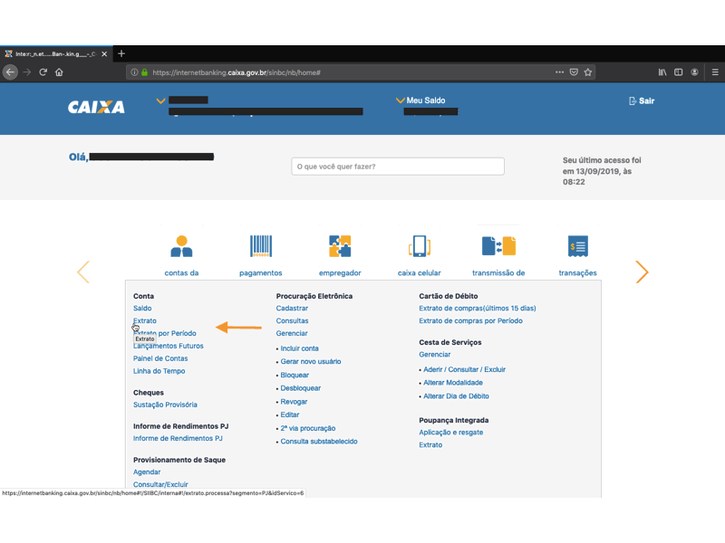

# Extratos Bancários Br

## O que é?
É um pequeno pacote que: recebe um extrato bancário em CSV e:

* INPUT: um ou mais extratos bancários em CSV (mesmo banco por vez).

* OUTPUT:
   1. Salva um arquivo JSON na máquina local;
   2. Retorna um JSON objeto ou um JSON string.

- - -
##  Por que?
Cada banco fornece o extrato bancário em padrão próprio.

Como trabalho com mais de um banco, senti a necessidade de padronizar os extratos para facilitar a manipulação dos dados.
- - -
## Instalação

```javascript
$ npm i extratosbancariosbr
```
- - -
## Como funciona?
```
const convertExtract = require('extratosBancariosBr').convert;

const jsonBankExtract = convertExtract(

   {
      csvDirPath: './',          // where the bank extracts are
      jsonDirPath: './JSON',     // where the json file wil be placed
      jsonFileName: 'extrato',   // json file name
      bankAccount: 'CEF003',     // CEF003 || CEF043 || ITAUPJ
      functionReturn: 'obj',     // obj    || str
   }

);

console.log(jsonBankExtract)

```
- - -
## Options

|    PROPERTY    |                 O QUE FAZ            |  DEFAULT |      OPTION       |
|:--------------:|:------------------------------------:|:--------:|:-----------------:|
|   csvDirPath:  | caminho da pasta onde estarão os CSVs|  './'    |                   |
|   jsonDirPath: | caminho da pasta onde estará o JSON  | './JSON' |                   |
|  jsonFileName: | nome do JSON                         |  extrato |                   |
|   bankAccount: | contas bancárias compatíveis         |    ''    |'CEF003' | 'ITAUPJ'|
| functionReturn:| returns either an object ou a string |   'obj'  |  'str'  | 'obj'   |

## Exemplo
### Cef003


